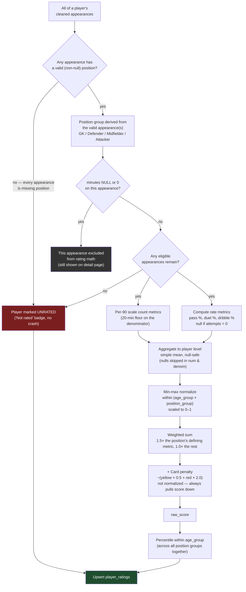

# Player Rating App

A small web app that turns a raw match-events export from youth football into
per-player ratings, expressed as percentiles within each age group.

- **Live app:** `https://player-rating-web-app-gwg8.vercel.app/`
- **Source CSV:** `match_events.csv` (365 rows, one row per player per match)

---

## 1. What it does

1. **Ingest** — upload the CSV through the UI (or `POST /api/ingest` directly);
   data is cleaned, validated, and upserted into Supabase.
2. **Rate** — every player gets a rating, computed as a percentile against
   other players in the same age group.
3. **List** — all players, searchable by name, sortable by rating/name/appearances,
   filterable by age group and position group.
4. **Detail** — one page per player: rating, the matches behind it, and the
   raw per-match numbers.

---

## 2. Schema, and why it's shaped this way

Four tables: `players`, `matches`, `appearances` and `player_ratings`.
`appearances` is the fact table — it mirrors the CSV row-for-row (one row per
player per match) and is what everything else derives from. `players` and
`matches` are normalized out of it so identity and fixture context aren't
repeated on every row.

```sql
players         (id, name, age_group, created_at)
                UNIQUE(name, age_group)

matches         (id, match_date, competition, age_group,
                 home_team, away_team, created_at)
                id = the CSV's match_id (e.g. 'M-1503')
                CHECK (age_group IN ('U15','U17'))

appearances     (id, player_id -> players, match_id -> matches,
                 position, team, opponent, venue,
                 goals_for, goals_against,
                 <all 24 per-match stat columns from the CSV>)
                UNIQUE(match_id, player_id)

player_ratings  (player_id -> players [PK], age_group,
                 overall_score, percentile, matches_played, updated_at)
```

**The one decision worth explaining: player identity.**

The CSV has no player ID — only a name string. Data inspection surfaced a
case that made this a real design decision rather than a formality: **"Pablo
Ruiz" appears in both U15 and U17**, with completely different stat lines
(FB in U15, W in U17). There's no way to know, from this data, whether that's
one kid playing up an age group or two different kids who share a name.

Given that ambiguity, identity is scoped to **`(name, age_group)`** rather
than name alone. This is the safer default: it can never silently merge two
different children's statistics into one rating, at the cost of occasionally
treating one player as two if a name genuinely does span age groups. That
trade-off is stated here explicitly rather than hidden — it's a best-effort
identity, not a guaranteed one.

This decision was also the source of the single most instructive bug in this
project (see Section 8, Approach Note) — worth knowing the identity design was
actually load-bearing, not just theoretical.

**Other schema choices:**
- `UNIQUE(match_id, player_id)` on `appearances` makes ingestion idempotent
  and is the final safety net against the CSV's one exact duplicate row
  (`Aitor Cordero`, match `M-1703`) — deduplication also happens earlier, in
  the cleaning pipeline, before this constraint is ever tested.
- `player_ratings` is a derived/cache table, fully recomputed from scratch on
  every ingest (see Section 5) rather than updated incrementally — a new player can
  shift the normalization range for their whole cohort, which changes
  everyone else's percentile too. Incremental updates would silently go
  stale.

---

## 3. Ingestion & data management

Ingestion is upsert-based, not replace-based: uploading a CSV **adds to** the
existing dataset. Matches are matched by `match_id`, players by
`(name, age_group)`, appearances by `(match_id, player_id)`. Uploading the
same file twice is a no-op; uploading a file with new rows adds them without
disturbing what's already there.

**Self Initiative:** A **"Clear Data"** control exists on the main list page for resetting to an
empty database before a fresh import. It's gated behind a typed confirmation
(`DELETE`) since this app has no authentication layer and the endpoint is
technically reachable by anyone with the URL — an accepted trade-off given
this assignment's scope and time-box. A production version of this app would
put this, and the ingest endpoint, behind auth.

Every ingest automatically triggers a full ratings recompute afterward —
there is no state where new data sits in the database with stale ratings
next to it.

---

## 4. What I noticed about the data

The export is genuinely "as-is" — real, realistic messiness, all found by
inspecting the actual file rather than assuming it was clean:

| Issue | Where | How it's handled |
|---|---|---|
| Exact duplicate appearance | `Aitor Cordero`, `M-1703` | Deduplicated before insert; DB constraint is the backstop |
| Team name casing/whitespace | `"Real Madrid "`, `"atletico madrid"` | Trimmed + canonicalized to one form per team |
| Player name casing/whitespace | `"cesar herrera "` vs `"Cesar Herrera"`; `"Samuel  Alonso"` (double space) | Trimmed, whitespace collapsed, title-cased — merged into one identity, since this is a formatting difference, not a different fact |
| Abbreviated name | `"C. Herrera"` (U17) | **Not** auto-merged with `Cesar Herrera`, even though it's very likely the same player — an initial-only match is an inference, not a confirmed fact. Left as its own low-confidence, flagged identity rather than silently guessed |
| Non-ISO dates | `11/04/2026`, `05/04/2026` | Ambiguous as DD/MM vs MM/DD on their own (both day and month ≤ 12). Resolved to **DD/MM/YYYY**, justified by (a) every other match in the file falls between 2026-03-14 and 2026-04-25 — only the DD/MM reading of both dates falls inside that window — and (b) the clubs involved are Spanish, where DD/MM is the locale convention |
| `passes_completed > passes_attempted` | `Arnau Fuster`, `M-1701` (69 completed vs 65 attempted) | Preserved as-is, not silently clipped or corrected — flagged as a validation warning, since guessing which number is wrong would be inventing data |
| `minutes_played = 0` with non-zero stats | `Nil Andrade`, `M-1701` | Row kept and shown on the player's detail page, but excluded from rating computation (see Section 5, eligibility rules) |
| Missing values | 5 separate rows, each missing exactly one field: `position` (Mateo Otero, M-1707 — see Section 5 for how this affects his rating), `minutes_played` (Hugo Andrade, M-1506), `touches` (Izan Galan, M-1706), `duels_won` (Javi Quintana, M-1706), `recoveries` (Kike Nogales, M-1506) | Preserved as `NULL`, never coerced to `0` — a missing value and an explicit zero mean different things, and treating them the same would understate those players' real activity |

Two totals worth stating precisely, since they're easy to get subtly wrong
and were verified directly against the source file: **365 source rows → 364
after deduplication**, and **183 distinct player identities (91 U15 + 92
U17)**.

---

## 5. How the rating is computed



**Eligibility.** An appearance with `minutes_played` null or `0` is excluded
from rating math (but still shown on the player's detail page). A player is
excluded from rating entirely if no valid position is recorded across any of
their appearances, or if none of their appearances meet the playing time threshold —
they still appear in the list with an explicit "Not rated" state. If a player has a
missing position on one appearance but a valid position on another (e.g. `Mateo Otero`,
who played `CM` in `M-1704` and had a missing position in `M-1707`), their position group
is derived from their valid appearance(s) and all eligible appearances contribute to their
aggregated rating.

> **Caught-and-fixed, not the original design:** an earlier version of this
> logic excluded a player entirely if *any single* appearance lacked a
> position, even when another appearance clearly established it. `Mateo
> Otero` was the case that surfaced this — the detail page's header badge
> correctly showed "Midfielder" (from his valid appearance) while a separate
> banner below it claimed no position was ever recorded — a direct
> contradiction on the same screen that got caught and corrected. See §8 for
> how this was found. `[confirm: X players rated / Y unrated after the fix]`

**Positions**: GK -> Goal Keeper, CB ->	Center Back, FB ->	Full Back, CM ->	Central, W ->	Winger, ST ->	Striker

**Position groups.** GK → GK; CB/FB → Defender; CM/W → Midfielder; ST →
Attacker. Different positions contribute to a match in genuinely different
ways, so ratings use a shared framework but select the metrics that reflect
each group's primary responsibilities, rather than one formula for everyone.

**Per-90 scaling.** Count-based stats (tackles, progressive passes, etc.) are
scaled to a 90-minute basis: `stat × 90 / minutes_played`, with the
denominator floored at 20 minutes. This stops a very short cameo (e.g. 5
minutes with 1 lucky tackle) from producing an absurd per-90 spike. It reduces volatility from short
appearances, it does not exclude them.

**Rate stats** (pass completion %, duel win %, dribble success %) are not
per-90 scaled — they're already ratios. If the relevant attempts are 0 in a
given appearance (e.g. 0 duels attempted), that metric is excluded from that
specific appearance's contribution rather than treated as 0%.

**Aggregation to player level.** Each metric is averaged across a player's
eligible appearances using a simple mean, over non-null observations only —
a null observation is excluded from both the numerator and denominator for
that metric, not treated as a zero.

> This is a stated simplification, not a solved problem: per-90 scaling
> normalizes magnitude, it does not equalize statistical reliability. A
> 20-minute appearance and a 90-minute appearance carry different confidence
> even after both are scaled to a 90-minute basis. With most players in this
> dataset having only 1–2 eligible matches, a more sophisticated
> reliability-weighting scheme was judged not worth the added complexity for
> this exercise — but it's a real limitation, not an invisible one.

**Metrics per position group** (all per-90 unless marked %):

| Group | Metrics |
|---|---|
| GK | recoveries, clearances, pass completion % |
| Defender (CB, FB) | tackles + interceptions, duel win %, clearances, pass completion % |
| Midfielder (CM, W) | progressive passes, pass completion %, duel win %, goals + assists |
| Attacker (ST) | goals + assists, shots on target, dribble success %, duel win % |

**Normalization.** Each metric is min-max scaled to 0–1 within its
`(age_group × position_group)` cohort: `(value - min) / (max - min)`. If
every player in a cohort has an identical value, normalized score is set to
0.5 for all of them rather than dividing by zero. Min-max was chosen over
z-scores for simplicity and explainability — a bounded 0–1 scale is easy to
combine across metrics and easy to justify in a sentence. The known
trade-off: it's sensitive to outliers and small cohorts. The smallest cohort
here is GK at 6 players per age group; everything else is 11–40.

**Weighting.** Each position's single most defining metric gets weight 1.5;
everything else gets 1.0 (e.g. pass completion % for GK/Midfielder,
tackles+interceptions for Defenders, goals+assists for Attackers). This is
an editorial judgment call, not a tuned model — stated as such rather than
dressed up as more rigorous than it is.

**Card penalty.** `-(yellow_cards_per90 × 0.5 + red_cards_per90 × 2.0)`,
applied directly to the raw score, not min-max normalized (so it always
pulls the score down and is never rescaled away). Checked empirically
against this dataset rather than left as a theoretical risk: there are
**zero red cards** in the entire file, and yellow cards appear in only 38 of
365 appearances (mean ≈0.18 per-90). The realistic per-player penalty is on
the order of −0.05 to −0.15, nowhere near large enough to overwhelm a raw
score typically in the 0–6 range — no adjustment to the constants was
needed, but this was confirmed by computing it, not assumed.

**Percentile.** Within each age group, across all position groups together
(since scores are already position-adjusted by that point):

```
percentile = (players in this age group with a strictly lower score)
             / (total rated players in this age group - 1) × 100
```
Rounded to 1 decimal place. (A defensive guard exists for the case of
exactly 1 rated player in an age group — set percentile to 50.0 rather than
divide by zero — though with ~90 rated players per age group here, this
never actually triggers.)

**Full recomputation, always.** Ratings are never updated incrementally.
Every ingest recomputes the entire eligible cohort per age group from
scratch, because one player's data can shift the normalization range that
every other player in their cohort is scored against.

**Verified example** (worked by hand against the raw CSV, not just trusted
from pipeline output): Pablo Ruiz (U17, Midfielder) — appearances at
`M-1703` (60 min: 11/13 passes, 2/8 duels won) and `M-1705` (90 min: 12/19
passes, 4/6 duels won) — aggregates to 73.9% pass completion, 45.8% duel
win rate, 6.0 progressive passes/90; normalized and weighted, this comes to
a raw score of **1.0671**, landing at the **13.3th percentile** of U17.

---

## 6. Known limitations

- **Player identity is inferred, not guaranteed.** The source data provides
  no unique player ID. `(name, age_group)` is a best-effort proxy; an
  abbreviated name (`C. Herrera`) was deliberately left unresolved rather
  than guessed.
- **Sample size is small.** Most players have only 1–2 eligible matches
  behind their rating. Percentiles from this few data points will move a
  lot as more matches are added.
- **Min-max normalization is sensitive to small cohorts and outliers**,
  most notably for goalkeepers (6 per age group).
- **Metric weighting is a stated judgment call**, not a fitted or validated
  model.
- **No opponent-strength adjustment.** A strong game against a weak side
  counts the same as an equally strong game against a tough one — the data
  does include `goals_for`/`goals_against` per match, which could support
  this with more time.
- **Simple mean treats a 20-minute appearance and a 90-minute appearance as
  equally reliable**, which they aren't, even after per-90 scaling.
- **The clear-data control is unauthenticated**, an accepted risk given the
  assignment's scope.

---

## 7. What I'd do differently with a week

- Add a small reliability adjustment (e.g. shrinking single-appearance
  players' scores toward their cohort mean, or minutes-weighting the
  aggregate) instead of leaving low-sample noise fully stated but
  unaddressed.
- Build a lightweight opponent-strength adjustment using the match-level
  `goals_for`/`goals_against` data already in the file.
- Add a manual-review queue for ambiguous name matches like `C. Herrera`,
  instead of leaving them permanently unrated.
- Add authentication in front of the ingest and clear-data endpoints.
- Add automated tests for `lib/rating.ts`'s pure functions (they're
  structured to be trivially testable, but no test suite exists yet).
- Track rating history over time rather than only the latest snapshot, once
  there's more than one short run of fixtures to compare across.

---

## 8. Approach note & AI tool usage

This was built with heavy, deliberate AI assistance, used as a build partner
rather than a black box — every phase was specified as a structured prompt,
the output was checked against the actual CSV (not just trusted), and issues
were traced back to root cause before moving on.

**Tools used:**
- **Antigravity** (agentic coding tool) — wrote all the actual code across
  four phases: schema + cleaning pipeline, ingestion API, rating engine,
  frontend.
- **ChatGPT & Claude** — used to review every phase's plan *before* building it (e.g.
  catching that a naive `UNIQUE(name)` player-identity constraint would
  silently merge two different children's stats, before any code was
  written), to independently verify Antigravity's completion reports against
  the real CSV rather than accepting them at face value, and to draft the
  structured prompts given to Antigravity for each phase.

**What was tried and discarded.** An early draft rating design used a
12-metric-per-position weighting table (~40+ individual coefficients across
four position groups). This was discarded in favor of the leaner ~5-metric
model in Section 5.

**Where I got stuck.** 
1. The most instructive problem in this project was a
real regression, not a hypothetical one: the CSV contains two different
players both named "Pablo Ruiz" (one U15, one U17), which is exactly why
player identity was scoped to `(name, age_group)` rather than name alone.
Despite that schema decision being correct, a later bug in the rating
pipeline's internal reporting layer — a `Map` keyed by `player_name` instead
of `player_id` — caused the second Pablo Ruiz's rating to silently overwrite
the first's during a verification step. It was caught specifically because
every phase's testing process deliberately included a spot-check on this
known duplicate-name case, traced to a single line, and fixed by keying
identity by `player_id` everywhere past the initial CSV parse. It's the
strongest evidence in this whole project that the identity design mattered
in practice.

2. A second, unrelated bug surfaced later, in the eligibility logic rather than
identity: the original rule excluded a player from rating entirely if *any
one* of their appearances had a missing `position`, without checking whether
another appearance of theirs had a valid one. `Mateo Otero` has two
appearances — one at `CM`, one with a missing position — and the bug
incorrectly treated him as having no position at all. It was caught by
noticing a direct contradiction on his own detail page: the header badge
correctly showed "Midfielder" while a separate "why unrated" banner claimed
no position was ever recorded. That inconsistency was the tell — two pieces
of logic disagreeing about the same player is a stronger signal than either
one looking wrong in isolation. Fixed by deriving a player's position group
from any valid position across their appearances, and only excluding a
player entirely when *no* appearance has one.

---

## 9. Tech stack

- Next.js 16 (App Router) + TypeScript
- Tailwind CSS v4
- Supabase (PostgreSQL), RLS for public reads, service-role key for writes
- Deployed on Vercel